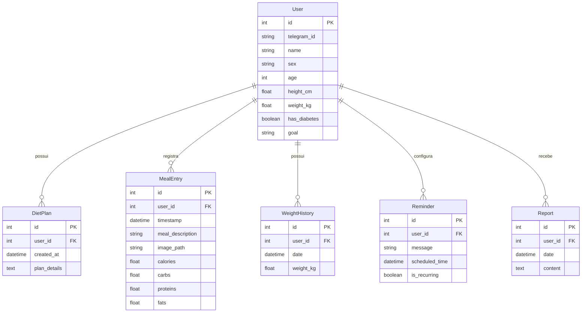

### Diagrama ER das Entidades do Banco de Dados

### Descrição do Diagrama ER das Entidades do Banco de Dados

- **User**: Representa os usuários do sistema. Cada usuário possui os seguintes atributos:
  - `id`: Identificador único do usuário (chave primária).
  - `telegram_id`: Identificador do usuário no Telegram.
  - `name`: Nome do usuário.
  - `sex`: Sexo do usuário.
  - `age`: Idade do usuário.
  - `height_cm`: Altura do usuário em centímetros.
  - `weight_kg`: Peso atual do usuário em quilogramas.
  - `has_diabetes`: Indica se o usuário tem diabetes (verdadeiro/falso).
  - `goal`: Objetivo nutricional do usuário (por exemplo, perder peso, ganhar massa muscular).

- **DietPlan**: Representa os planos de dieta personalizados criados para os usuários.
  - `id`: Identificador único do plano de dieta (chave primária).
  - `user_id`: Referência ao usuário associado (chave estrangeira).
  - `created_at`: Data e hora em que o plano foi criado.
  - `plan_details`: Detalhes completos do plano de dieta.

- **MealEntry**: Registros das refeições consumidas pelos usuários.
  - `id`: Identificador único da entrada de refeição (chave primária).
  - `user_id`: Referência ao usuário que registrou a refeição (chave estrangeira).
  - `timestamp`: Data e hora em que a refeição foi consumida.
  - `meal_description`: Descrição detalhada da refeição.
  - `image_path`: Caminho para a imagem da refeição armazenada.
  - `calories`: Calorias estimadas da refeição.
  - `carbs`: Quantidade de carboidratos (em gramas).
  - `proteins`: Quantidade de proteínas (em gramas).
  - `fats`: Quantidade de gorduras (em gramas).

- **WeightHistory**: Histórico dos registros de peso dos usuários ao longo do tempo.
  - `id`: Identificador único do registro de peso (chave primária).
  - `user_id`: Referência ao usuário associado (chave estrangeira).
  - `date`: Data do registro de peso.
  - `weight_kg`: Peso do usuário em quilogramas na data especificada.

- **Reminder**: Lembretes configurados pelos usuários para receber notificações.
  - `id`: Identificador único do lembrete (chave primária).
  - `user_id`: Referência ao usuário que configurou o lembrete (chave estrangeira).
  - `message`: Mensagem ou descrição do lembrete.
  - `scheduled_time`: Data e hora agendada para o lembrete.
  - `is_recurring`: Indica se o lembrete é recorrente (verdadeiro/falso).

- **Report**: Relatórios gerados para os usuários com informações sobre seu progresso.
  - `id`: Identificador único do relatório (chave primária).
  - `user_id`: Referência ao usuário associado (chave estrangeira).
  - `date`: Data em que o relatório foi gerado.
  - `content`: Conteúdo detalhado do relatório, incluindo análises e insights.

### Relacionamentos entre as Entidades

- **User** `possui` múltiplos **DietPlan**:
  - Um usuário pode ter vários planos de dieta associados a ele ao longo do tempo.
  
- **User** `registra` múltiplos **MealEntry**:
  - Os usuários podem registrar quantas refeições desejarem, permitindo o acompanhamento detalhado de sua alimentação diária.
  
- **User** `possui` múltiplos **WeightHistory**:
  - Cada registro de peso é associado a um usuário específico, criando um histórico de peso que pode ser analisado para observar tendências e progresso.
  
- **User** `configura` múltiplos **Reminder**:
  - Os usuários podem configurar lembretes personalizados para refeições, suplementações ou outras atividades relacionadas à sua dieta e saúde.
  
- **User** `recebe` múltiplos **Report**:
  - Relatórios semanais ou mensais são gerados para os usuários, fornecendo insights sobre seu desempenho, hábitos alimentares e progresso em relação aos seus objetivos.

### Visão Geral do Diagrama

O diagrama ER representa a estrutura do banco de dados do **IA Nutricionista**, mostrando como as diferentes entidades interagem entre si:

- **Centralização no Usuário**: Todas as entidades principais estão diretamente relacionadas ao **User**, indicando que cada funcionalidade do sistema é personalizada e específica para cada usuário.

- **Acompanhamento Personalizado**:
  - **DietPlan** permite que planos alimentares sejam criados e associados aos usuários, oferecendo orientações nutricionais específicas.
  - **MealEntry** possibilita que os usuários mantenham um diário alimentar, registrando suas refeições e obtendo feedback nutricional.
  - **WeightHistory** fornece um histórico do peso do usuário, essencial para monitorar o progresso em direção aos objetivos definidos.
  - **Reminder** ajuda os usuários a manterem a disciplina, enviando notificações nos horários programados.
  - **Report** oferece análises e insights baseados nos dados coletados, ajudando os usuários a entenderem melhor seus hábitos e ajustarem suas rotinas conforme necessário.

Este modelo de dados suporta as principais funcionalidades do sistema, garantindo que todas as informações relevantes sejam armazenadas de forma organizada e estejam facilmente acessíveis para processamento e análise pelo agente nutricionista.